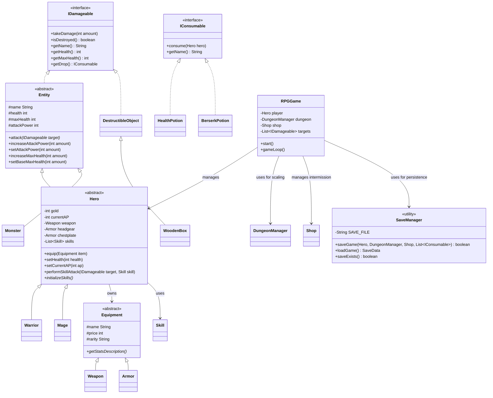

# Roguelike RPG Dungeon: Design Document

This document outlines the architectural decisions and design choices for the Roguelike RPG Dungeon overhaul.

## Class Diagram (Updated)

## Design Rationale

### 1. Roguelike Progression & Scaling
- **`DungeonManager`**: Centralizes depth tracking and enemy scaling logic. Stats for `Monster` objects scale linearly with depth, ensuring a consistent challenge as the player progresses.
- **`Search` Mechanism**: Instead of static encounters, the "Search" mechanic introduces randomness and choice, key pillars of the Roguelike genre.

### 2. Equipment & Stat System
- **Composition over Inheritance**: The `Hero` class uses composition to manage its gear (`Weapon`, `Armor`). This allows for dynamic stat calculation where the effective attack and health are derived from base stats plus equipment bonuses.
- **Encapsulation**: Equipment details (damage bonuses, health bonuses) are encapsulated within their respective classes, following the **Single Responsibility Principle**.

### 3. Combat Skills & Strategy (AP System)
- **`Skill` Class**: Instead of a single "Attack" method, heroes now have a `List<Skill>`. This provides depth to combat through an **AP (Action Point) system**, where players must manage energy costs to choose between standard hits (which restore AP) and high-damage (but costly) special moves.

### 4. Game State Persistence (Save/Load)
- **`SaveManager`**: A dedicated utility class that handles serialization of the game state to a text file. It uses a key-value pair format to store everything from basic hero info to complex inventory states.
- **Stat Integrity**: The system preserves not just current health/gold, but also permanent powerups (base stats) and shop progression, ensuring a seamless experience across multiple sessions.
- **Meta-Progression**: The `respawnHero` method in `RPGGame` demonstrates how object state can be partially reset while preserving high-value progress (Gear/Gold), facilitating the "Roguelite" loop.

### 5. OOP Criteria Fulfillment
- **Abstraction**: `IDamageable` and `IConsumable` interfaces allow the game engine to interact with objects without knowing their concrete implementation.
- **Inheritance**: A rich hierarchy from `Entity` to `Warrior`/`Mage` and `Equipment` to `Weapon`/`Armor` ensures code reuse and logical structuring.
- **Polymorphism**: Used extensively in combat (skills), drops (boxes/monsters), and items (potions).
- **Encapsulation**: Strict use of access modifiers and public API methods (e.g., `setAttackPower`, `setHealth`) to protect internal object state while allowing controlled restoration from save files.
