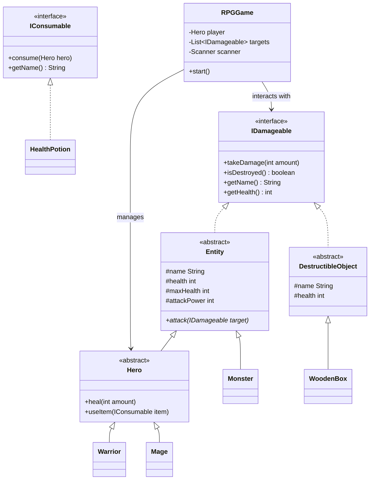

# RPG Project: Design Document

This document outlines the architectural decisions and design choices made for the Java Text-Based RPG.

## Class Diagram (Mermaid)

## Design Rationale

### 1. Interface-Based Interaction (`IDamageable`)
The core design philosophy revolves around the `IDamageable` interface. Instead of having separate methods to attack monsters and objects, the `Hero` interacts with an interface. This allows for seamless polymorphism where any object that can "take damage" (living or non-living) can be targeted by the same combat logic.

### 2. Abstract Base Classes (`Entity` and `DestructibleObject`)
- **Entity**: Consolidates shared attributes like `health`, `name`, and `attackPower` for all living characters. This follows the **DRY (Don't Repeat Yourself)** principle, preventing code duplication across `Hero` and `Monster` classes.
- **DestructibleObject**: Specifically handles objects that don't have combat logic (like attacking back) but still possess health.

### 3. Separation of Concerns
- **`game` package**: Logic for the game loop, user interface, and initialization is separated from the data models. This makes the codebase easier to maintain and test.
- **`models` package**: Focuses purely on the properties and behaviors of individual game elements.

### 4. Robustness through Input Validation
To ensure a professional user experience (and prevent crashes during a demo), the `getValidIntInput` method centralizes scanner logic. It uses a `try-catch` block to handle non-integer strings and checks for valid ranges, ensuring the game loop is resilient against user error.

### 5. Strategy for Scaling
The implementation of `IConsumable` allows the game to support a wide variety of items (Mana Potions, Buffs, etc.) without modifying the `Hero` class logic. This follows the **Open/Closed Principle**—the system is open for extension but closed for modification.
